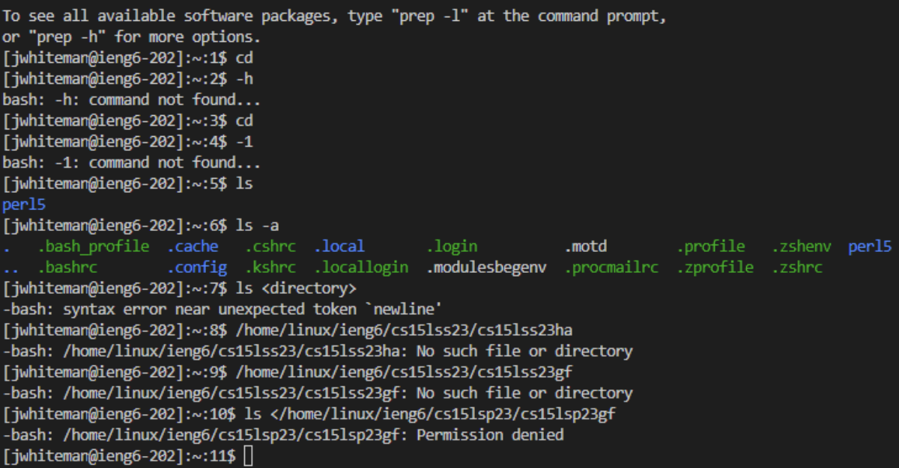

# Lab Report 1 - Remote Access and FileSystem (Week 1)
**In this lab there is seven parts that I completed but I will be showing you the first five.**

## Part 1 – Meet Your Group!
In Part 1 all you do is introduce yourself to the group that you are assigned to as in mine the was seven people. What we each did was go around stating are major, college, answer the question of the week and after just talked for a little to get to know each other. It was nice and I recomend you talk to them as they will be the ones helping you when yopu need it. 

## Part 2 – Your CSE15L Account
This part can be confusing as for me it was not bad but many people struggled with it. Your first need to go to this [HERE](https://sdacs.ucsd.edu/~icc/index.php) then enter your schools email which for me looks like this jwhiteman@ucsd.edu and then enter your schools email password. After this you should be logged in and then you want to click on **cs15lsp23hc** course and make sure you change your password just for the course not for everything. Yours might look different as each person as there own cs15lsp23 with to characters at the end to make you unique mine is hc but it can be anything thats you are given this will be your username so rember that goes with your password you made. Then I learned you want to give it some time before you go on to part 3. 

## Part 3 – Visual Studio Code
You want to then install **Visual Studio Code** which if you are in the lab the computers already have it. I also had it already installed in my computer as well but once you have it installed you want to open it and should see this image.

## Part 4 – Remotely Connecting
In this part I had a lot of trouble and it took me a long time to get it to work. But first you need to download git if you have windows to use git bash which I did nort need to do cause I have Mac and on the lab computers it is already downloaded. Then open up the terminal in Visual Studio Code and type **ssh** or just open on the bottle where it says terminal which I did. As now is where it gets hard you know that password you used and change for **cs15lsp23hc** which is my username it didn't work. As what you need to do is take that username cs15lsp23hc and add @ieng6.ucsd.edu to it making it look like **cs15lsp23hc@ieng6.ucsd.edu** in which it should then ask you a question where you then say yes and enter you password. But this did not work for me no matter how many times I tried so instead I used my schools email jwhiteman@ucsd.edu and added @ieng6.ucsd.edu to it so it should now look like this **jwhiteman@ieng6.ucsd.edu** and then I did the rest which was click yes, entering my emails password. It worked as you can see here. 

## Part 5 – Run Some Commands
Now onces you get this part down you will run some commands in which I did. Here they are and make sure to do them in this order.
1.cd ~, 2.cd, 3.ls -lat, 4.ls -a, 5.ls <directory> where <directory> is /home/linux/ieng6/cs15lsp23/cs15lsp23abc, where the abc is one of the other group members username. 
**In this part I did put a others members name which again is cs15lsp23gf but I got denied.**
This is what it looks like.

  
# This is the end of Lab Report 1 - Remote Access and FileSystem (Week 1).
